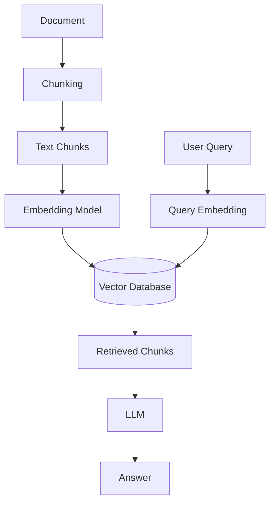
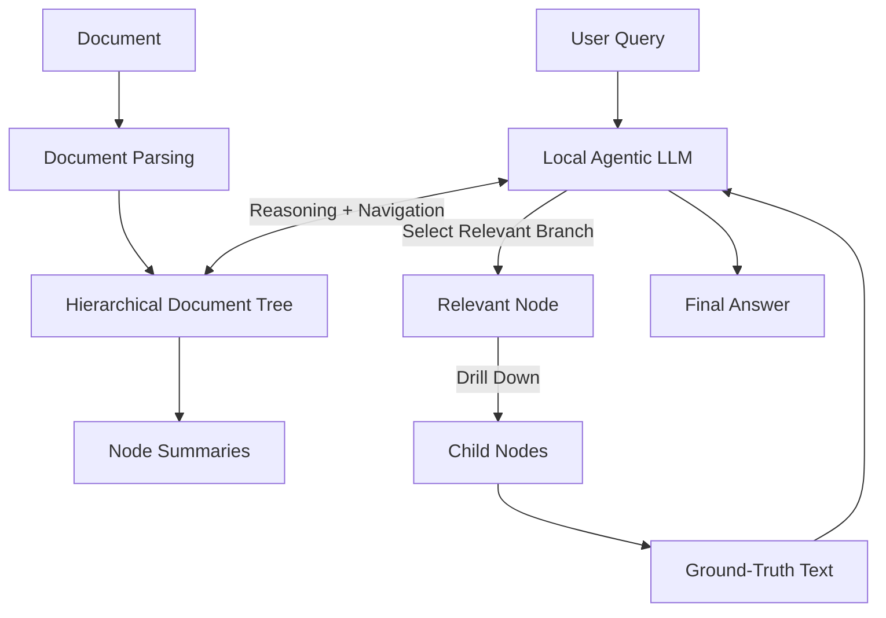

<div align="center">

# 🌲 PageIndex Local: Agentic RAG from Scratch

**A fully local, open-source implementation of vectorless, reasoning-based Retrieval-Augmented Generation (RAG).**

[](https://www.python.org/)
[](https://github.com/VectifyAI/PageIndex)
[](https://ollama.com/)
[](https://opensource.org/licenses/MIT)

<br>

<a href="#-overview">Overview</a> •
<a href="#-architecture">Architecture</a> •
<a href="#%EF%B8%8F-prerequisites">Prerequisites</a> •
<a href="#-quickstart">Quickstart</a> •
<a href="#-under-the-hood">Under the Hood</a> •
<a href="#-project-structure">Project Structure</a>

</div>

---

## 📖 Overview

Most Retrieval-Augmented Generation (RAG) systems follow a pipeline based on **document chunking, embeddings, and vector similarity search**.

While vector-based retrieval is powerful, fixed-size chunking can sometimes separate information that is naturally connected within a document. This can make it harder for a retrieval system to understand the document's original structure and navigate between related sections.

**PageIndex Local** explores an alternative approach: **tree-based, vectorless RAG**.

This project uses [PageIndex](https://github.com/VectifyAI/PageIndex) to transform a document into a hierarchical representation based on its natural structure, such as:

```text
Document
│
├── Chapter / Section
│   ├── Subsection
│   │   ├── Paragraph
│   │   └── Paragraph
│   └── Subsection
│
└── Chapter / Section
```

A local LLM, served through [Ollama](https://ollama.com/), acts as the reasoning engine. Instead of performing vector similarity search, the model navigates the document tree, evaluates relevant sections, drills down into promising branches, and retrieves the underlying text needed to answer the user's question.

### 🎯 Goals

This repository is primarily a learning and experimentation project focused on understanding:

- 🌲 Hierarchical document indexing
- 🤖 Agentic retrieval
- 🔎 Vectorless RAG
- 🧠 LLM-based reasoning and navigation
- 🛠️ Tool-based retrieval
- 🏠 Fully local LLM inference
- 📄 Structured document understanding

The entire pipeline can run locally without requiring an external LLM API or vector database.

---

## 🧠 Architecture

The core idea is to replace **embedding-based retrieval** with **hierarchical navigation and reasoning**.

### Traditional Vector RAG



### PageIndex Agentic RAG



### 🔑 Key Difference

| Vector RAG | PageIndex Agentic RAG |
|---|---|
| Chunks documents | Preserves document hierarchy |
| Uses embeddings | Uses LLM reasoning |
| Requires vector database | No vector database required |
| Similarity-based retrieval | Tree navigation |
| Retrieves top-k chunks | Dynamically explores relevant branches |
| Context determined primarily by similarity | Context determined by document structure + reasoning |

---

## ⚙️ Prerequisites

### Operating System

Recommended:

- Linux
- Windows + WSL2
- Ubuntu 24.04

### Hardware

A GPU is recommended for fast local LLM inference.

This project has been tested with:

- **GPU:** NVIDIA RTX 6000 Ada Generation
- **VRAM:** 48 GB
- **System RAM:** 128 GB

Smaller GPUs can also be used depending on the local model and inference configuration.

### Software

Make sure the following are installed:

- Python 3.10+
- Git
- Ollama

Check your installations:

```bash
python --version
git --version
ollama --version
```

---

# 🚀 Quickstart

## 1. Clone the Repository

```bash
git clone https://github.com/<your-username>/pageindex-local-rag.git
cd pageindex-local-rag
```

---

## 2. Create a Virtual Environment

### Linux / WSL2

```bash
python3 -m venv venv
source venv/bin/activate
```

### Windows PowerShell

```powershell
python -m venv venv
.\venv\Scripts\Activate.ps1
```

Install the dependencies:

```bash
pip install -r requirements.txt
```

---

## 3. Start the Local LLM

Install [Ollama](https://ollama.com/) if you have not already done so.

Pull the Llama 3.1 model:

```bash
ollama pull llama3.1
```

You can verify that the model is available with:

```bash
ollama list
```

To test the model:

```bash
ollama run llama3.1
```

Ollama normally exposes its local API at:

```text
http://localhost:11434
```

Keep Ollama running while executing the RAG pipeline.

---

## 4. Download the Sample Document

The default example uses the research paper:

> **Attention Is All You Need**

Download it directly into the project directory:

```bash
curl -L -o attention_is_all_you_need.pdf \
https://arxiv.org/pdf/1706.03762.pdf
```

Alternatively, download it manually from:

https://arxiv.org/abs/1706.03762

Your project directory should now contain:

```text
pageindex-local-rag/
├── attention_is_all_you_need.pdf
├── app.py
├── inspect_tree.py
├── requirements.txt
└── ...
```

---


## 5. Run the RAG Pipeline

Start the application:

```bash
python app.py
```

The application will:

1. Load the PDF.
2. Parse the document structure.
3. Build a hierarchical document tree.
4. Generate summaries for relevant nodes.
5. Connect the retrieval process to the local Ollama LLM.
6. Allow the LLM to navigate the tree.
7. Retrieve relevant source text.
8. Generate the final answer.

---

# 🔍 Under the Hood

## What Does a "Vectorless Document Tree" Look Like?

You can inspect the generated document tree using:

```bash
python inspect_tree.py
```

A simplified representation may look like:

```json
{
  "node_id": "root",
  "title": "Attention Is All You Need",
  "summary": "A research paper introducing the Transformer architecture.",
  "children": [
    {
      "node_id": "section_1",
      "title": "1. Introduction",
      "summary": "Discusses limitations of recurrent neural networks.",
      "children": []
    },
    {
      "node_id": "section_3",
      "title": "3. Model Architecture",
      "summary": "Describes the encoder-decoder architecture and self-attention mechanism.",
      "children": [
        {
          "node_id": "section_3.1",
          "title": "3.1 Encoder and Decoder Stacks",
          "summary": "Explains the structure of the encoder and decoder."
        }
      ]
    }
  ]
}
```

The exact structure depends on the document and the indexing process.

---

## 🕵️ Inspecting the Agent Trace

When building Agentic RAG with local models (like Llama 3.1 8B), you will often encounter **Tool Hallucinations**—where the LLM understands what to do, but generates the wrong JSON schema for the tool.

We built an internal trace inspector in `app.py` to watch the agent's internal reasoning, tool calls, and tool errors in real time. 

### Prompt-Based Schema Enforcement
To fix tool schema hallucinations in smaller models without fine-tuning, we use the `instructions` parameter to strictly enforce the schema rules at runtime:

bash
python
stream = client.chat(
question,
doc_id=doc_id,
stream=True,
instructions=(
"When using get_page_content, you MUST provide the required "
"pages argument. Never use page_range, start_index, or end_index."
)
)

Running `python app.py` will now output a color-coded trace showing the exact API calls the agent makes to the document tree, making it incredibly easy to debug and optimize local LLM behavior.

**Why this matters:**
Traditional RAG cuts documents into meaningless 1,000-character chunks. PageIndex builds a hierarchical tree (Chapters -> Sections -> Paragraphs). During a query, the LLM agent actively reads the node summaries and navigates down the most relevant branches—simulating how a human uses a Table of Contents to find an answer without reading the whole book.


## 🧭 How Retrieval Works

Suppose the user asks:

> **"Why does the Transformer use self-attention instead of recurrent networks?"**

The retrieval process can conceptually look like:

```text
User Query
    │
    ▼
Local LLM
    │
    ▼
Root Node
    │
    ├── Introduction
    │      └── Relevant
    │
    ├── Model Architecture
    │      └── Highly Relevant
    │
    └── Experiments
           └── Less Relevant
                 │
                 ▼
          Drill into Section
                 │
                 ▼
          Find relevant text
                 │
                 ▼
          Return context
                 │
                 ▼
              LLM
                 │
                 ▼
             Answer
```

Instead of asking:

> "Which chunks have the highest embedding similarity?"

the system can reason about:

> "Which part of the document is most likely to contain the answer?"

This is the central idea behind the **agentic retrieval** approach explored in this project.

---

# 🆚 Vector RAG vs. Agentic Tree RAG

### Vector RAG

```text
Document
   │
   ▼
Chunking
   │
   ▼
Embeddings
   │
   ▼
Vector Database
   │
   ▼
Similarity Search
   │
   ▼
Top-K Chunks
   │
   ▼
LLM
```

### Agentic Tree RAG

```text
Document
   │
   ▼
Structure Extraction
   │
   ▼
Hierarchical Tree
   │
   ▼
LLM Reasoning
   │
   ▼
Navigate Tree
   │
   ▼
Relevant Section
   │
   ▼
Ground-Truth Text
   │
   ▼
LLM
```

The important distinction is that the second approach treats the document as a **structured information space** rather than simply a collection of independent text chunks.

---

# 📁 Project Structure

```text
pageindex-local-rag/
│
├── app.py
│   └── Main RAG application
│
├── inspect_tree.py
│   └── Inspect the generated document tree
│
├── requirements.txt
│   └── Python dependencies
│
├── attention_is_all_you_need.pdf
│   └── Sample document
│
├── README.md
│
└── .gitignore
```

Your actual project structure may contain additional files depending on the implementation.

---

# 🧪 Example Workflow

A typical execution looks like:

```text
                    ┌────────────────────┐
                    │      PDF File      │
                    └─────────┬──────────┘
                              │
                              ▼
                    ┌────────────────────┐
                    │  PageIndex Parser  │
                    └─────────┬──────────┘
                              │
                              ▼
                 ┌─────────────────────────┐
                 │ Hierarchical Document   │
                 │          Tree           │
                 └────────────┬────────────┘
                              │
                              ▼
                    ┌────────────────────┐
                    │    User Query      │
                    └─────────┬──────────┘
                              │
                              ▼
                    ┌────────────────────┐
                    │   Local LLM        │
                    │  Llama 3.1         │
                    └─────────┬──────────┘
                              │
                       Reason + Navigate
                              │
                              ▼
                    ┌────────────────────┐
                    │ Relevant Tree Node │
                    └─────────┬──────────┘
                              │
                         Drill Down
                              │
                              ▼
                    ┌────────────────────┐
                    │ Source Text        │
                    └─────────┬──────────┘
                              │
                              ▼
                    ┌────────────────────┐
                    │    Final Answer    │
                    └────────────────────┘
```

---

# 🧩 Why Build This Locally?

This project is designed to make the architecture easy to experiment with and inspect.

### No external LLM API required

The reasoning model runs locally through Ollama.

### No vector database

The retrieval process does not depend on:

- FAISS
- Chroma
- Pinecone
- Weaviate
- Milvus
- Qdrant

### Inspectable retrieval

The generated document tree can be inspected directly, making it easier to understand how the system represents and navigates documents.

### Open-source experimentation

The project can be extended with different:

- Local LLMs
- Document types
- Retrieval strategies
- Agentic workflows
- Tool-calling strategies
- Evaluation datasets

---

# 🛠️ Possible Extensions

Some directions for future development include:

- [ ] Support multiple PDF documents
- [ ] Add a document ingestion pipeline
- [ ] Add a web-based chat interface
- [ ] Support additional Ollama models
- [ ] Add streaming responses
- [ ] Add retrieval tracing and visualization
- [ ] Add RAG evaluation benchmarks
- [ ] Compare tree-based retrieval against vector RAG
- [ ] Add hybrid tree + vector retrieval
- [ ] Add citation tracking
- [ ] Add document-level and node-level caching
- [ ] Add support for Markdown and HTML documents

---

# 📊 Evaluation

A useful next step is to benchmark this approach against conventional vector RAG.

Potential evaluation dimensions include:

| Metric | Description |
|---|---|
| Retrieval Accuracy | Whether the correct section is retrieved |
| Context Precision | How much retrieved context is actually relevant |
| Context Recall | Whether required information is retrieved |
| Answer Accuracy | Whether the generated answer is correct |
| Faithfulness | Whether the answer is supported by the source |
| Retrieval Latency | Time required to locate relevant information |
| Token Usage | Number of tokens processed during retrieval |
| Infrastructure Cost | Local compute and storage requirements |

This allows the project to move beyond demonstrating the architecture and toward a measurable comparison between **vector-based and tree-based retrieval**.

---

# 🤝 Contributing

Contributions, issues, and feature requests are welcome.

If you have ideas for improving the retrieval strategy, evaluation methodology, document parsing, or local inference pipeline, feel free to open an issue or submit a pull request.

---

# 📚 References

- **PageIndex:** https://github.com/VectifyAI/PageIndex
- **Ollama:** https://ollama.com/
- **Attention Is All You Need:** https://arxiv.org/abs/1706.03762
- **Python:** https://www.python.org/

---

# 📄 License

This project is released under the **MIT License**.

See the `LICENSE` file for more information.

---

<div align="center">

### ⭐ If you find this project useful, consider giving the repository a star!

**Built for learning, experimentation, and understanding agentic retrieval from the ground up.**

</div>
